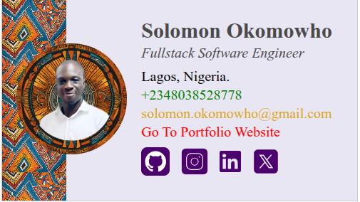

# How to Build Email Signatures

## 📅 Day 1

### **Design 1**
- **Task Date:** May 6, 2025  
- **Submission Deadline:** May 8, 2025 by 1 PM  
- **Reminder Deadline:** May 7, 2025 by 10 PM  

# 🌍 HTML Signature Design — Solomon Okomowho

A professional HTML email signature built for **Solomon Okomowho**, Fullstack Software Engineer. This signature combines clean design, branding consistency, and African-inspired visuals to create a memorable and functional digital identity.

## ✨ Features

- 📸 Profile photo with rounded styling
- 🖼️ Background pattern representing African heritage
- 🔗 Clickable social media icons (PNG format)
- 📱 Contact info with `tel:` and `mailto:` links
- 🧩 Table-based layout for maximum email compatibility
- 🌐 Responsive design that adapts to most email clients

## 📸 Final Product Preview

### ✅ Screenshot

> Right-click the image below and open in a new tab to view full size



### 🌍 Live Preview (Will be available soon)

> View the final signature live in the browser  
> **🔗 [Live Preview](https://your-live-preview-link.com)**

## 📁 Project Structure

```
html-signature/
├── index.html            # Main signature file
├── README.md             # Project documentation
├── img/
│   ├── darthus.png       # Profile photo
│   ├── colorful-pattern.png  # Background pattern
│   ├── github.png        # GitHub icon
│   ├── instagram.png     # Instagram icon
│   ├── linkedin.png      # LinkedIn icon
│   └── x.png             # X (Twitter) icon
```

## 🚀 Usage Instructions

1. **Clone or download the project**:
   ```bash
   git clone https://github.com/yourusername/html-signature.git
   ```

2. **Open `index.html` in any browser** to preview.

3. **Customize your details** (name, title, contacts, social links) as needed.

4. **Embed it into your email client**:
   * Copy and paste the HTML code into your email signature settings.
   * Image assets are already hosted on PostImages with permanent direct HTTPS URLs.

## 🛠️ Tech Stack

* **HTML5**
* **Inline CSS** (optimized for email rendering)
* **PNG icons and assets**
* **PostImages hosting** for reliable image delivery

## 🧑‍💻 Author

**Solomon Okomowho**
- 👨🏾‍💻 Fullstack Software Engineer
- 📍 Lagos, Nigeria
- 📧 solomon.okomowho@gmail.com
- 📞 +2348073631253
- 🌐 [Portfolio](https://tinyurl.com/solomonokomowho/)
- 🔗 [LinkedIn](https://linkedin.com/in/solomon-okomowho)
- 🐦 [X (Twitter)](https://x.com/darth-jade-i)

## 💼 Professional Services

I offer custom email signature and template design services for individuals and businesses. If you need:
- Professional HTML email signatures
- Responsive email templates
- Brand-consistent digital communication assets
- Custom designs with African-inspired elements

**Please contact me at solomon.okomowho@gmail.com for inquiries and rates.**

## 📝 License

This project is licensed under the **MIT License**. Feel free to use, modify, and integrate it into your personal or business emails.

© KKF Solutions & Resource 2025